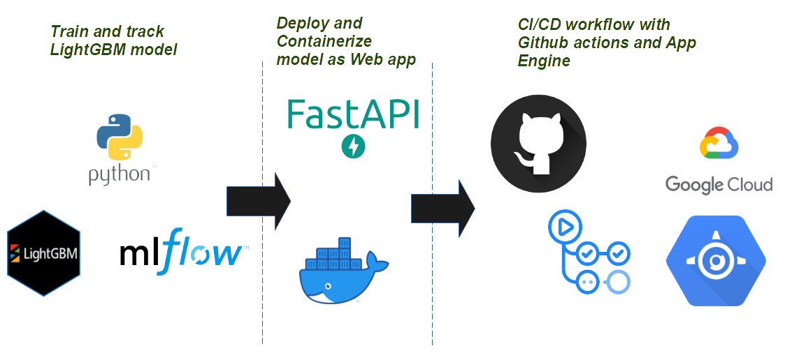

# Deploying Machine Learning as Web App  

## Data Information
Data used in the project can be found on [UCI Machine Learning Repository](https://archive.ics.uci.edu/ml/datasets/Maternal+Health+Risk+Data+Set)

*Data has been collected from different hospitals, community clinics, maternal health cares from the rural areas of Bangladesh through the IoT based risk monitoring system.*

### Attribute Information:

- Age: Any ages in years when a women during pregnant.  
- SystolicBP: Upper value of Blood Pressure in mmHg, another significant attribute during pregnancy.
- DiastolicBP: Lower value of Blood Pressure in mmHg, another significant attribute during pregnancy.
- BS: Blood glucose levels is in terms of a molar concentration, mmol/L.
- HeartRate: A normal resting heart rate in beats per minute.
- Risk Level: Predicted Risk Intensity Level during pregnancy considering the previous attribute.

## Workflow Architecture
 

## Requirements
* Python 3.8
* Docker
* Google Cloud Plateform account

## Quick Start
* Clone the repository
<pre>
git clone https://github.com/amine-akrout/mental_health_risk
</pre>
* Create a virtual and install requirements
<pre>
python -m venv
pip install -r requirements.txt
</pre>
* Train LightGBM using Pycaret and log metrics and artifacts with MLflow
<pre>
python ./model.py
</pre>

**MLflow experiment**
  

## Test locally
To test the web app locally using docker, start by building the image from the Dockerfile
<pre>
docker build --pull --rm -f "Dockerfile" -t mentalhealthrisk:latest "."
</pre>

<pre>
docker run -p 8080:8080 mentalhealthrisk
</pre>
the Web app should be runnining on http://localhost:8080/

## Deploy to Google Cloud App Engine

<pre>
gcloud app deploy
</pre>

## CI/CD workflow
Using Github actions and [app_engine.yml](https://github.com/amine-akrout/mental_health_risk/blob/master/.github/workflows/app_engine.yml), we could continuously deploy the web app by simply using the term "deploy" in the commit message when pushing to main branch

## Demo

  

## References:
* Data source: Marzia Ahmed, Email: ahmed.marzia32@gmail.com
Institution: Daffodil International University, Dhaka, Bangladesh.

* Deploy App Engine [Continuous deployment to Google App Engine using GitHub Actions](https://github.com/google-github-actions/deploy-appengine)
